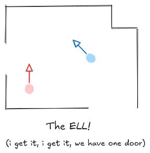
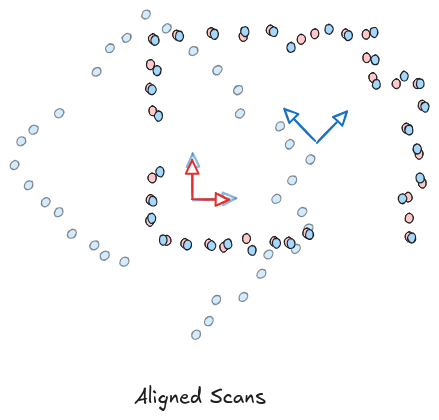

# Iterative Closest Point (ICP) - An Illustrated Guide

## Motivation
Iterative closest point (ICP) is an algorithm for *scan matching*. In most cases, scans are represented as some kind of *point cloud*, a collection of points in space. Point clouds can come from LiDARs, depth cameras, or any other sensor that produces some kind of map of the environment around our vehicle. Scan matching asks how to align two such scans. To be more illustrative, imagine you have a room like the ELL and you take LiDAR scans from two different locations

When we get these LiDAR scans, we get them *from the robot's perspective*. So if we just naively combined the scans by overlaying them we might get something like this

The reason it looks like this is because, though you and I have the luxury of looking at the whole room from a consistent top-down perspective, our robot does not---it sees a rotated and translated view of the world depending on where it is. If it looks at the world from two different locations, it's going to see two very different things.

So, the goal of scan matching, then, is to find out how to *rotate and translate* the points in one of the scans so that they best-match the points in the other. In an ideal world, we're looking for this:

There will be some sensor noise, so it's not perfect, but this would be a pretty good result!

But *why in the world* would we even want to do this? Well, if we know how to move each of the points in one scan so that they align with the points in the other scan, we can *know where one scan was taken relative to the other*.

## The problem, formally

Frame the problem from a robotics perspective, i.e. find the rotation and translation between reference frames. Want to minimize squared dist according to some oracle matching?

## The (approximate) solution
Say we will approximate by assuming we know the oracle

Explain the optimization problem and how to solve it (formal)

We don't know the oracle! But it's good enough.

## Variations
It's a big world

### Trimmed
### Point-to-Line / Point-to-Plane

## References