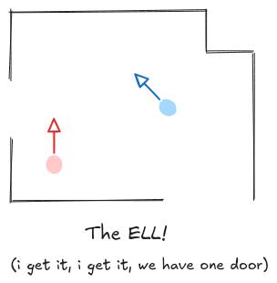

# Iterative Closest Point (ICP) - An Illustrated Guide

## Motivation
Iterative closest point (ICP) is an algorithm for *scan matching*. In most cases, scans are represented as some kind of *point cloud*, a collection of points in space. Point clouds can come from LiDARs, depth cameras, or any other sensor that produces some kind of map of the environment around our vehicle. Scan matching asks how to align two such scans. To be more illustrative, imagine you have a room like the ELL and you take LiDAR scans from two different locations

## The problem, formally

Frame the problem from a robotics perspective, i.e. find the rotation and translation between reference frames. Want to minimize squared dist according to some oracle matching?

## The (approximate) solution
Say we will approximate by assuming we know the oracle

Explain the optimization problem and how to solve it (formal)

We don't know the oracle! But it's good enough.

## Variations
It's a big world

### Trimmed
### Point-to-Line / Point-to-Plane

## References